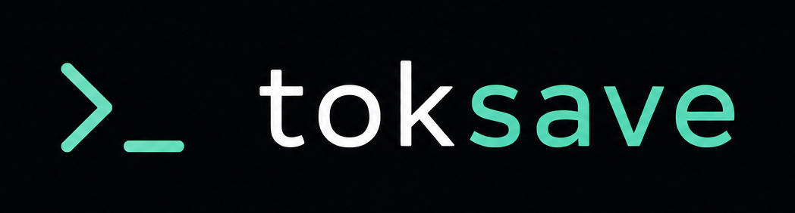

<div align="center">
  

  # toksave

  **Zero-config token-saver for AI coding agents.**

  [](https://opensource.org/licenses/MIT)
  [](https://bun.sh)
  [](https://www.typescriptlang.org/)
  [](https://github.com/agungprasastia/toksave/actions)

  <p align="center">
    Install and wire <a href="https://github.com/rtk-ai/rtk">RTK</a>, <a href="https://github.com/JuliusBrussee/caveman">Caveman</a>, <a href="https://github.com/colbymchenry/codegraph">CodeGraph</a>, and <a href="https://github.com/mksglu/context-mode">Context-Mode</a> into your AI agents — without hand-editing configs.
  </p>
</div>

<hr />

## ✨ Features

- **Zero-config:** Run one command to equip all your agents.
- **Smart Health Checks:** Built-in diagnostics verify installations and `toksave doctor --fix` can repair unhealthy tools.
- **Actionable Error Messages:** When things fail, get clear explanations and remediation steps.
- **Download Resilience:** Automatic retry with exponential backoff handles flaky networks.
- **Idempotent & Safe:** Run multiple times without duplicating configurations.
- **Clean Uninstall:** Tracks what it installed so it can cleanly revert changes.
- **Cross-platform:** Ships as a standalone binary for macOS, Linux, and Windows.
- **Preview Changes:** Use `--dry-run` to see what will happen before committing.

## 🤖 Supported Agents & Tooling

| Agent | MCP | Hooks | Caveman | Context-Mode Rules |
|-------|:---:|:---:|:---:|:---:|
| **Claude Code** | ✅ | RTK hook + instructions | ✅ SKILL.md | ✅ AGENTS.md |
| **OpenCode** | ✅ | RTK plugin + instructions | ✅ AGENTS.md | ✅ AGENTS.md |
| **Codex** | ✅ (TOML) | RTK hook + instructions | ✅ instructions.md | ✅ instructions.md |
| **Antigravity** | ✅ (JSON) | RTK hook + instructions | ✅ SKILL.md | ✅ AGENTS.md |

## 📦 What Gets Installed

| Tool | Method | What It Does |
|------|--------|-------------|
| **RTK** | Prebuilt binary | CLI proxy that compresses tool output — **60-90% token savings** |
| **Caveman** | Markdown from GitHub | Communication mode that cuts LLM response tokens **~75%** |
| **CodeGraph** | `npm install -g` | Pre-indexed code knowledge graph — **fewer tool calls** |
| **Context-Mode**| `npm install -g` | MCP server that sandboxes tool output — **98% context reduction** |

## 🚀 Getting Started

### Prerequisites

- **Node.js ≥ 22** (required for CodeGraph and Context-Mode)
- At least one supported AI agent installed

### Install

**macOS / Linux:**
```bash
curl -fsSL https://raw.githubusercontent.com/agungprasastia/toksave/main/scripts/install.sh | bash
```

**Windows (PowerShell):**
```powershell
irm https://raw.githubusercontent.com/agungprasastia/toksave/main/scripts/install.ps1 | iex
```

## 💻 Usage

### Quick Start
```bash
# Interactive setup — detect agents, install tools, wire everything
toksave
```

### Advanced Commands

| Command | Description |
|---------|-------------|
| `toksave` | Install + wire all tools into detected agents |
| `toksave doctor` | Read-only health check with diagnostics and repair suggestions |
| `toksave doctor --fix` | Repair unhealthy tool installations, then report health after repair |
| `toksave update` | Update all tools to latest versions |
| `toksave uninstall` | Remove toksave wiring from agents |
| `toksave self-update` | Update the toksave CLI itself |

### Helpful Flags

| Flag | Description |
|------|-------------|
| `-a, --agents <ids>` | Target specific agents (e.g., `claude,antigravity`) |
| `-t, --tools <ids>`  | Target specific tools (e.g., `rtk,caveman`) |
| `-n, --dry-run`      | Preview changes without modifying anything |
| `-y, --yes`          | Skip prompts, auto-select detected agents (CI-friendly) |
| `-v, --verbose`      | Show detailed output |

## 🛠️ Development

Built with TypeScript + [Bun](https://bun.sh). Compiles to a standalone binary via `bun build --compile`.

```bash
# Clone and install dependencies
git clone https://github.com/agungprasastia/toksave.git
cd toksave
bun install

# Development tasks
bun run src/index.ts      # Run CLI in dev mode
bun run typecheck         # Run TypeScript checks
bun test                  # Run unit tests
bun run lint              # Lint with Biome
bun run build             # Build local binary

# Build all cross-platform releases
bash scripts/build-release.sh
```

See [CHANGELOG.md](CHANGELOG.md) for release history and detailed changes.

## 📜 License

Licensed under the MIT License — [see LICENSE](LICENSE).
