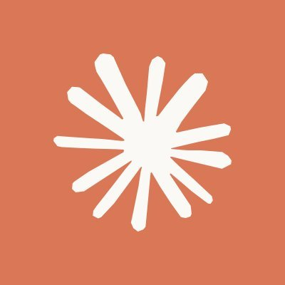
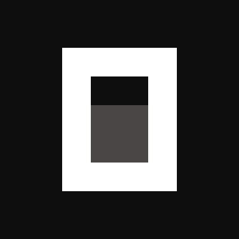
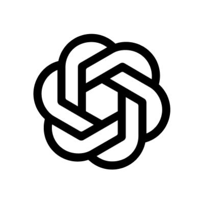
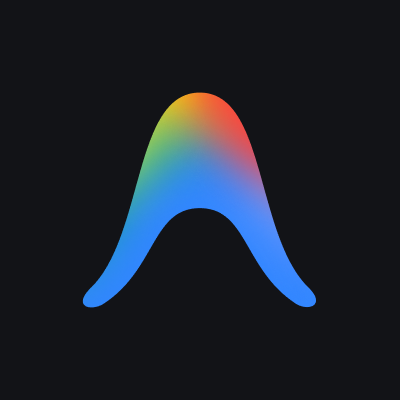
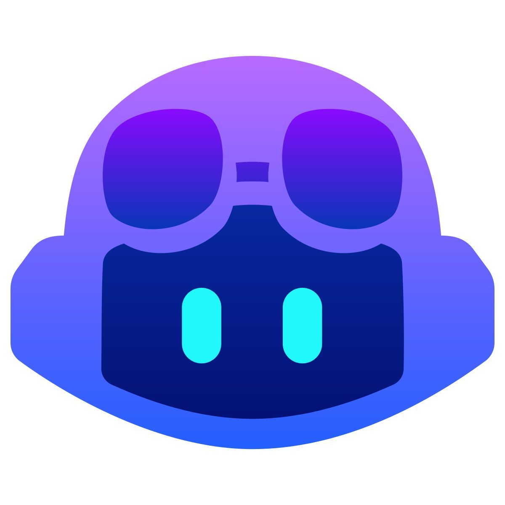
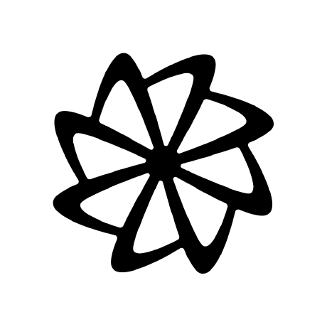

<div align="center">
  
  <br/><br/>

  <h1>toksave</h1>
  <p><strong>Zero-config toolchain for token-efficient AI coding agents.</strong></p>

  <p>
    <a href="https://github.com/agungprasastia/toksave/releases"></a>
    <a href="#"></a>
    <a href="LICENSE"></a>
    <a href="https://github.com/agungprasastia/toksave/actions/workflows/ci.yml"></a>
    <a href="https://github.com/agungprasastia/toksave/actions/workflows/release.yml"></a>
  </p>

  <p>
    One command to install and wire <a href="#-what-gets-installed">token-saving tools</a> into <a href="#️-supported-agents">6 AI coding agents</a>.
    No config editing. No manual setup. Just <strong>run, restart, go</strong>.
  </p>
</div>

---

## ✨ Why toksave?

AI coding agents are powerful, but they burn tokens on verbose output, redundant context, and missing guardrails. The fix exists — RTK, Caveman, CodeGraph, Context-Mode, Ponytail, and Principles each solve one piece. The hard part is **installing and wiring all of them** across multiple agents without breaking configs.

toksave handles the wiring so you can focus on the code.

| | Benefit |
|---|---|
| ✔️ | **Plug & play** — one command equips all your agents |
| ✔️ | **Idempotent** — safe to rerun, never duplicates configs |
| ✔️ | **Clean revert** — uninstall removes exactly what it added |
| ✔️ | **Cross-platform** — macOS, Linux, Windows |
| ✔️ | **Health checks** — `toksave doctor --fix` repairs broken installs |
| ✔️ | **Auto-index** — CodeGraph index builds on agent startup |

---

## 🤖️ Supported Agents

<div align="center">
  <table>
    <tr>
      <td align="center" width="140"><br/><b>Claude Code</b><br/><sub>✅ Supported</sub></td>
      <td align="center" width="140"><br/><b>OpenCode</b><br/><sub>✅ Supported</sub></td>
      <td align="center" width="140"><br/><b>Codex</b><br/><sub>✅ Supported</sub></td>
      <td align="center" width="140"><br/><b>Antigravity</b><br/><sub>✅ Supported</sub></td>
    </tr>
    <tr>
      <td align="center" width="140"><br/><b>GitHub Copilot</b><br/><sub>✅ Supported</sub></td>
      <td align="center" width="140"><br/><b>Droid</b><br/><sub>✅ Supported</sub></td>
    </tr>
  </table>
</div>

```bash
toksave                                      # interactive: pick agents
toksave --agents claude,opencode             # wire specific agents
toksave --agents claude,opencode,antigravity # or any combination
```

---

## 📦 What Gets Installed

### Tools

| Tool | Stars | Description |
| :--- | :---: | :--- |
| **RTK** |  | CLI proxy that compresses tool output — **60-90% token savings** |
| **Caveman** |  | Terse response mode — **~75% output token reduction** |
| **CodeGraph** |  | Pre-indexed code knowledge graph — **fewer MCP calls** |
| **Context-Mode** |  | MCP sandbox with session memory — **98% context compression** |
| **Ponytail** |  | Lazy-coding discipline — YAGNI, stdlib first, delete over add |
| **Principles** |  | Coding standards — think, simplify, edit surgically |

### Wiring Matrix

| Tool | Claude | OpenCode | Codex | Antigravity | Copilot | Droid |
| :--- | :--- | :--- | :--- | :--- | :--- | :--- |
| **RTK** | Hook + Allow | Plugin | Hook | Hook + Allow | Hook + Allow | Hook |
| **Caveman** | Plugin + Instr. | Plugin + Instr. | Skill + Instr. | Skill + Instr. | Skill + Instr. | Skill + Instr. |
| **Ponytail** | Plugin + Instr. | Plugin + Instr. | Plugin + Instr. | Plugin + Instr. | Skill + Instr. | Skill + Instr. |
| **CodeGraph** | MCP + Allow + Instr. | MCP + Auto-index | MCP + Instr. | MCP + Hook + Instr. | MCP + Hook + Instr. | MCP + Hook + Instr. |
| **Context-Mode** | MCP + Allow + Instr. | Plugin + Instr. | MCP + Hook + Instr. | MCP + Instr. | MCP + Hook + Instr. | MCP + Instr. |

---

## 🚀 Getting Started

### Prerequisites

- **Node.js ≥ 22** (required by CodeGraph and Context-Mode)
- At least one [supported agent](#️-supported-agents) installed

### Install

| Platform | Command |
| :--- | :--- |
| **macOS / Linux** | `curl -fsSL https://raw.githubusercontent.com/agungprasastia/toksave/main/scripts/install.sh \| bash` |
| **Windows** | `irm https://raw.githubusercontent.com/agungprasastia/toksave/main/scripts/install.ps1 \| iex` |

### Quick start

```bash
toksave                    # detects agents, installs tools, wires everything
# restart your agent, you're done
```

### Commands

| Command | Description |
| :--- | :--- |
| `toksave` | Install + wire all tools into detected agents |
| `toksave doctor` | Health check with repair suggestions |
| `toksave doctor --fix` | Repair unhealthy tool installations |
| `toksave update` | Update all tools to latest versions |
| `toksave uninstall` | Remove toksave wiring from all agents |
| `toksave disable` | Remove all wire/unwire + owner entries |
| `toksave index` | Pre-build CodeGraph index in current directory |
| `toksave self-update` | Update the toksave CLI itself |

### Flags

| Flag | Description |
| :--- | :--- |
| `-a, --agents <ids>` | Target agents (e.g., `claude,antigravity`) |
| `-t, --tools <ids>` | Target tools (e.g., `rtk,caveman`) |
| `-n, --dry-run` | Preview changes without writing |
| `-y, --yes` | Skip prompts, auto-select (CI-friendly) |
| `-v, --verbose` | Detailed logs |

> **Tip:** Restart your agent after running toksave so it picks up the new configuration.

---

## 🛠️ Development

Built with TypeScript + [Bun](https://bun.sh). Compiles to a standalone binary.

```bash
git clone https://github.com/agungprasastia/toksave.git
cd toksave
bun install

bun run src/index.ts       # Run CLI in dev mode
bun run typecheck          # TypeScript checks
bun test                   # 151 unit tests
bun run lint               # Biome lint
bun run build              # Local binary

bash scripts/build-release.sh  # Cross-platform release build
```

---

## 📜 License

[MIT](LICENSE) — see [CHANGELOG.md](CHANGELOG.md) for release history.
